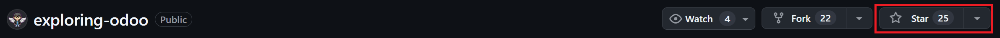
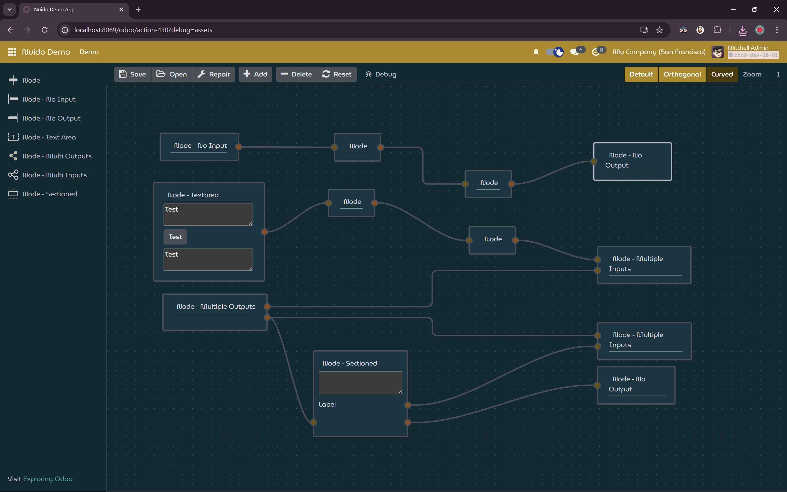
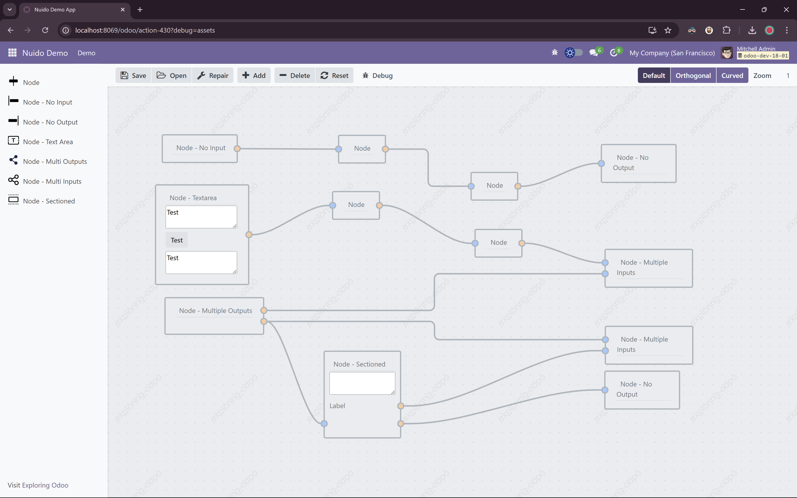
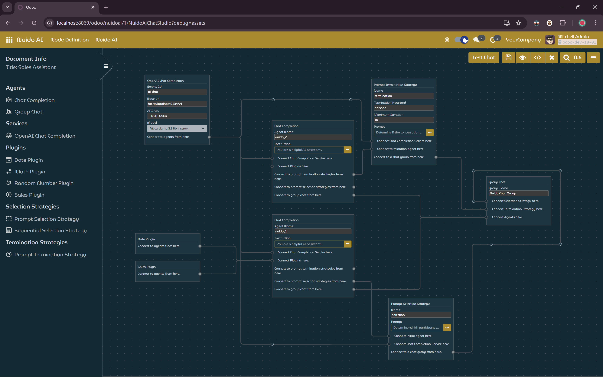
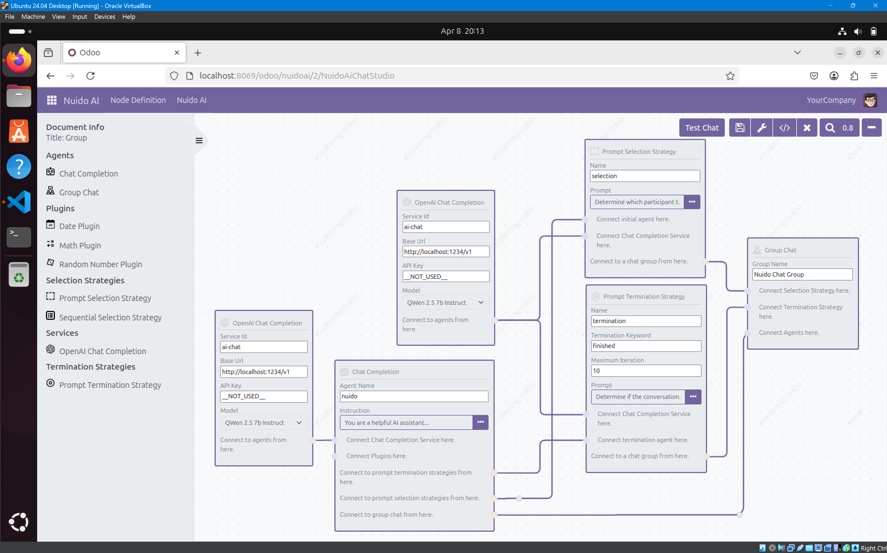
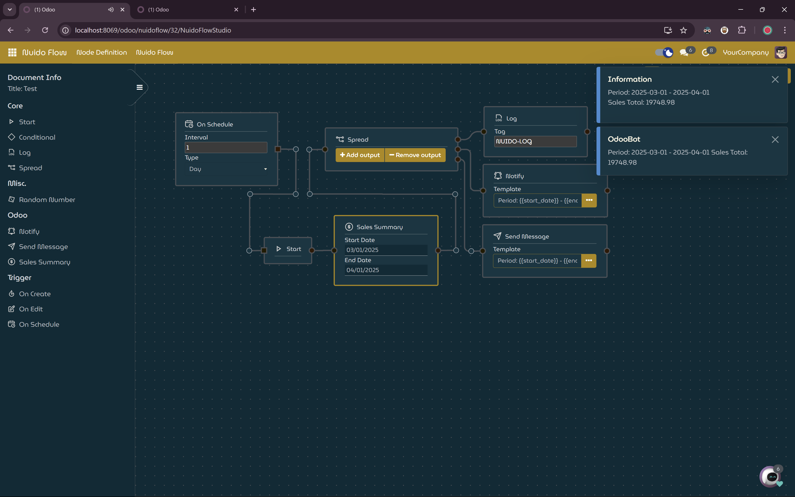
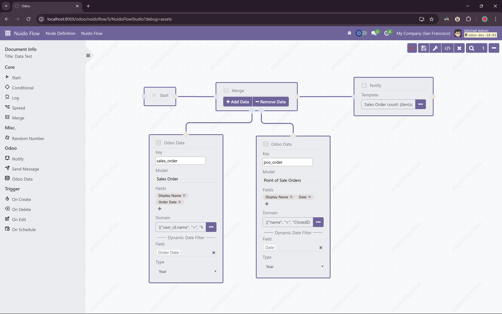

# Exploring Odoo
This repository contains source codes presented in youtube channel [Exploring Odoo](https://www.youtube.com/@exploring-odoo)

## Please keep this repo alive by giving it a star and sharing it.
By giving this repo a star you are not only supporting and keeping this repo alive, but it also gives me the motivation to keep updating this repo.

Click the star button on the right top to show your support:

# Nuido Branch
This branch is specific for Nuido related modules.

Nuido is a library to create node based user interface for Odoo.
## Demo
   ### Dark Theme
   
   ### Light Theme
   

Currently there are two experiments based on Nuido:
## Nuido AI: AI Chat Studio for Odoo
   ### Dark Theme
   
   ### Light Theme
   
## Nuido Flow: Automation for Odoo
   ### Dark Theme
   
   ### Light Theme
   

* The dark theme is not publicly available, but the stylesheet is included in nuido module. Although it's specifically made for my own theme, it follows Odoo's method to load it (using web.assets_web_dark). If your theme also follows this, you should be able to adjust it to match your theme.

Please visit [Exploring Odoo](https://www.youtube.com/@exploring-odoo) for more information.

> [!NOTE]
> This branch requires you to be comfortable with Odoo frameworks such ash the ORM, OWL, Qweb, etc. You don't need to be an expert, but you still need to understand the basics.
>
> In other words, this branch is not for total beginners. Although the codes are still beginner friendly, i.e., no advanced techniques, the concepts presented in this branch can be overwhelming and confusing for a total beginner.

> [!CAUTION]
> Everything in this repo is purely experimental and for educational purpose use only.
>
> Do not use it in any environment but in an experimental one, definitely not in a production environment.
>
> I'm not responsible for any damage or harm by the use of anything from this repo.
>
> Use it at your own risk.
>

> [!IMPORTANT]
> This repository only serves as an archive, bugs will not be fixed.
>
> The only test performed was to make sure things can be run on my environment to create videos for channel Exploring Odoo, and only for the specific scenario of the related video.
>
> So, again, use it at your own risk.
>
> I do not provide support in any kind.

> [!TIP]
> It is important to watch the related video of the module thoroughly and read the video description too.
>
> The information about external libraries used and the links for those libraries are in there.
>
> E.g, if you're having trouble with the datalabel extension for chart.js then you must have not watched the video thoroughly. Please watch the video again thoroughly this time.
>

>[!WARNING]
> This repo and the youtube channel is to help you learn. Not to provide you with fully functional module.
>
> If you're having trouble with the code, ask politely and nicely like a civil person.
>

>[!WARNING]
> Most of the client-side part of the addons/modules in this branch are created using typescript.
> Currently, I have no plan to publish the typescript files.
>
> The transpiled javascript files are provided so you can still use and study the modules.
>

>[!CAUTION]
> This branch is currently in active development, while the core/basic concepts doesn't change, the codes are expected to be changed depending on the issues I encounter while creating the video for them.

# Experimental Odoo Modules

| Name         | Folder       | Description                                                |
| ------------ | ------------ | ---------------------------------------------------------- |
| AI Chat Base | ai_chat_base | This module provides the base to create streaming AI chat. |
| Nuido        | nuido        | Node based UI for Odoo                                     |
| Nuido Demo   | nuido_demo   | Demonstrate Nuido                                          |

## Please keep this repo alive by giving it a star and sharing it.
